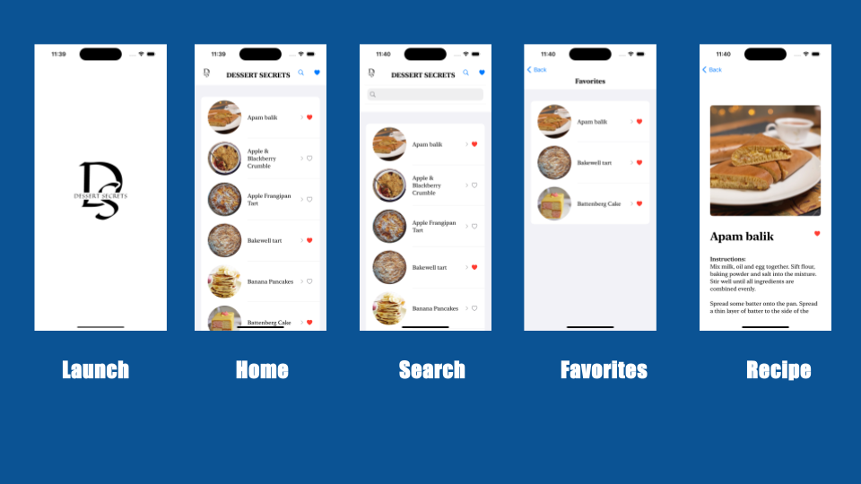

# Darryl-Fleurantin-Fetch-Coding-Challenge

## Views

#### Views

## Installation

To run this app locally, follow these steps:

1. Clone the repository: `git clone https://github.com/dSplashh/Darryl-Fleurantin-Fetch-Coding-Challenge.git`
2. Open Xcode and select `Open Existing Project...`
3. Open `Darryl-Fleurantin-Fetch-Coding-Challenge` in Xcode.
4. Build and run the project.
